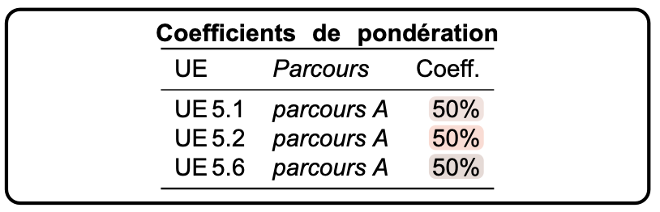

= Evaluation SAÉ S5.A.01 Dév. avancé
2024-2025
:icons: font
:s5: https://webetud.iut-blagnac.fr/course/view.php?id=1131[S5.A.01 -- Développement Avancé]

== Principes de base

La SAÉ {s5} compte pour une grosse partie du S5.
Aussi, les évaluations sont nombreuses et affectent les différentes compétences différemment.

.Rappel des compétences concernées :
[NOTE]
====
Compétence 1:: 
Choisir et implémenter les architectures adaptées; 
Intégrer des solutions dans un environnement de production
Compétence 2:: 
Anticiper les résultats de diverses métriques (temps d'exécution, occupation mémoire...); 
Choisir et utiliser des bibliothèques et méthodes dédiées au domaine d'application (imagerie, immersion, intelligence artificielle, jeux vidéos, parallélisme, calcul formel...)
Compétence 6::
Organiser et partager une veille numérique
====

== Décomposition des notes de compétences

Le tableau ci-dessous liste ces évaluations et leur impact sur les 
compétences{empty}footnote:[Les pourcentages indiqués ne concernent que la SAE et permettent de préciser comment la note rapportée dans la compétence en question est constituée.]

[cols="1,1,1,1,3",options="header"]
|===
| # | Évaluation | Compétence `C[1\|2\|6]` | Poids dans `C[1\|2\|6]` | Modalité
//------------------------------------------------------
| 1 | Satisfaction client    | C1 | 60%     | Grille évaluation 1
|  |     | C2 | 40%    | 
|  |     | C6 | 60%     | 

| 2 | Qualité du code        | C1 | 20%     | Eval enseignant (INIT 40%)
|   |                        | C2 | 40%     | (ALT 60%)
| 3 | Pitch du produit       | C1 | 20%     | Client 50% / IUT 50%

| 4 | Phase 4 (éval de code) | C2 | 40%    | Notation rapport (INIT uniquement)
| 5 | Phase 4 (pertinence)   | C2 | 20%    | Correlation rapport/note obtenue

| 6 | Sérieux de l'équipe    | C6 | 20%     | Appréciations séances encadrées
| 7 | Gestion de projet      | C6 | 20%     | Évaluation par les pairs
|===

1. Correspond à la note attribuée en transformant la grille d'évaluation par le client en note.
2. Evaluation objective du code rendu (même exercice que la phase 4, mais par un enseignant)
3. Moyenne de la note client et de la note enseignant sur le pitch
4. Correspond à l'évaluation du rapport rendu à la phase 4
5. Note reflétant l'écart entre l'évaluation étudiante et l'évaluation prof
6. Synthèse des appréciations réalisées lors des séances encadrées 
7. Évaluation par les pairs réalisée par Esther

== Calendrier

Vous venez de finir la phase 3 (V2 pour les ALT, v3 pour les INIT).

Rappel des demaines restantes :

* Phase 4
Semaine 48:: Pause, dépôts des releases finales zippées
https://webetud.iut-blagnac.fr/mod/assign/view.php?id=30174[ici]. 
Semaine 49--50:: 10 séances en mode projet pour analyser la qualité des codes 
Semaine 02--03:: 9 séances en mode projet pour terminer l'analyse et régiger le rapport

* Pitchs
Semaine 04:: Réalisation du pitch de votre application (2 séances en mode projet) 
et dépôt https://webetud.iut-blagnac.fr/mod/assign/view.php?id=29857[ici].

Pour les évaluations précédentes voici les dates importantes :

1. Grilles presques toutes récoltées pour la v1. Bientôt pour la v2. Notes attribuées environ *semaine 50*.
2. Evaluation objective du code rendu (même exercice que la phase 4, mais par un enseignant) *semaine 05*. 
3. Moyenne de la note client et de la note enseignant sur le pitch *semaine 05*
4. Evaluation du rapport rendu à la phase 4 *semaine 05*.
5. Note reflétant l'écart entre l'évaluation étudiante et l'évaluation prof *semaine 05*.
6. Synthèse des appréciations réalisées lors des séances encadrées  *semaine 50*.
7. Évaluation par les pairs réalisée par Esther *semaine 50*.
